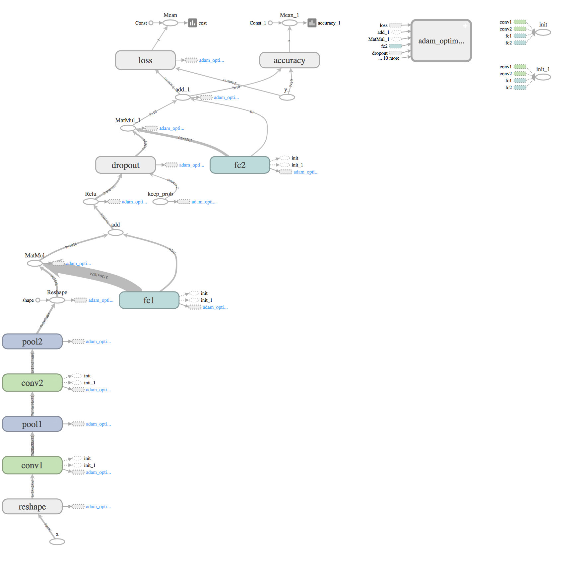
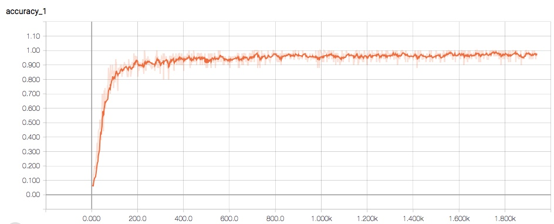
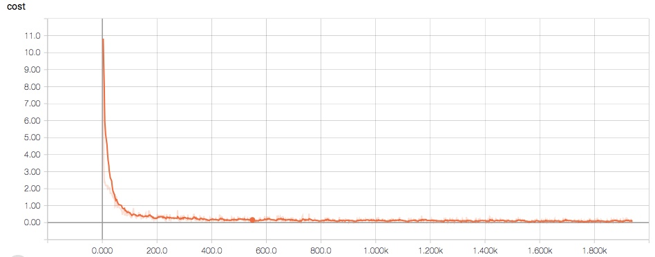

# AI-Admission-Project
Hi, there! Welcome to my github page. This repo is for AI Admission Project, a.k.a a record of start point for my AI classes.

## Project Name
MNIST Recognition

## Author
**Christina Huang**

## Summary of Project
This project is about a image recognition model of famous handwritten digit dataset [MNIST](http://yann.lecun.com/exdb/mnist/). Here I implemented a Convolution Neural Network based on Tensorflow to solve the problem which contains two convolutional layers and two pooling layers followed by one fully connected layer. I also added a dropout layer to avoid overfitting. The structure of this neural network generated by Tensorboard is shown below.

## Result
The training process of accuracy and cost, also generated by Tensorboard, is shown here. Aftern 2000 training the final test accuracy can reach up to 98.6%.

## Reference
For Tensorflow and Concolution Neural Network part: https://www.tensorflow.org/get_started/mnist/pros

For Tensorboard part: http://ischlag.github.io/2016/06/04/how-to-use-tensorboard/

